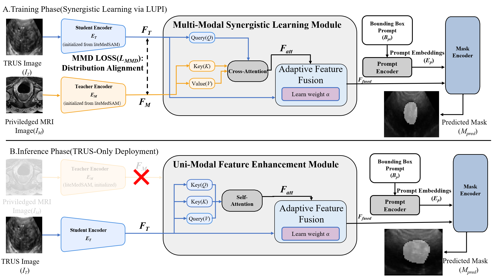

# PRISM

Official implementation of **PRISM**: **Privileged Representation-Informed Synergistic Model for Enhanced TRUS Segmentation**.

## Abstract

Transrectal ultrasound (TRUS) segmentation is clinically important but remains challenging because TRUS images often exhibit low contrast, blurred anatomical boundaries, and substantial appearance variability. PRISM addresses this problem through a privileged-learning framework in which MRI is used as privileged information during training to guide feature learning, while deployment remains TRUS-only. Specifically, PRISM initializes both student and teacher branches from LiteMedSAM, aligns latent representations across modalities with an MMD-based distribution constraint, and performs cross-modal feature interaction through a synergistic learning module with adaptive feature fusion. At inference time, the MRI branch is removed, and the learned feature interaction is transferred into a uni-modal enhancement path so that the model preserves the benefits of privileged supervision without requiring MRI input. This design enables PRISM to improve TRUS segmentation quality while maintaining a practical deployment setting.

## Framework



## Overview

This repository currently provides the core PRISM training and evaluation pipeline:

- `train_dual_modal.py` for dual-modal training with privileged MRI guidance
- `evaluate.py` for unified evaluation of prediction `.npz` files

## Expected Data Layout

```text
data/
  train/
    trus/
      imgs/
      gts/
    mri/
      imgs/
      gts/
  val/
    trus/
      imgs/
      gts/
    mri/
      imgs/
      gts/
```

## Installation

```bash
pip install -r requirements.txt
```

## Training

```bash
python train_dual_modal.py \
  -trus_data_root ./data/train/trus \
  -mri_data_root ./data/train/mri \
  -val_trus_data_root ./data/val/trus \
  -val_mri_data_root ./data/val/mri \
  -pretrained_checkpoint ./checkpoints/lite_medsam.pth \
  -work_dir ./work_dir/prism
```

## Evaluation

```bash
python evaluate.py \
  -pred_dir ./predictions \
  -gt_dir ./ground_truth \
  -output_csv ./evaluation_results.csv
```

## Notes

- `-trus_pretrained_checkpoint` and `-mri_pretrained_checkpoint` are optional. If omitted, the script falls back to `-pretrained_checkpoint`.
- The evaluation script expects prediction `.npz` files with a `segs` array and ground-truth `.npz` files with a `gts` array.

## License

This repository is released under the **Apache License 2.0**. See [LICENSE](LICENSE) for the full text.

## Acknowledgements

This project builds on and benefits from several important prior works and open-source efforts:

- **MedSAM / LiteMedSAM** for the medical adaptation of the Segment Anything framework and the lightweight initialization used in this repository.
- **LUPI (Learning Using Privileged Information)** for the privileged-information learning paradigm that motivates PRISM's training strategy.
- The **MR to Ultrasound Registration for Prostate Challenge** dataset and related open resources for enabling reproducible prostate MRI-TRUS research.
- Open-source community efforts that make code, pretrained models, and research artifacts accessible for reproducible medical AI research.

## Upstream References

The following references are included because they are relevant upstream works and resources used in the PRISM project context.

### MedSAM

```bibtex
@article{MedSAM,
  title={Segment Anything in Medical Images},
  author={Ma, Jun and He, Yuting and Li, Feifei and Han, Lin and You, Chenyu and Wang, Bo},
  journal={Nature Communications},
  volume={15},
  pages={654},
  year={2024}
}
```

### MR to Ultrasound Registration for Prostate Challenge Dataset

```bibtex
@dataset{baum2023mrus_prostate_challenge,
  author={Baum, Zachary M. C. and Saeed, Shaheer U. and Min, Zhe and Hu, Yipeng and Barratt, Dean C.},
  title={MR to Ultrasound Registration for Prostate Challenge - Dataset},
  year={2023},
  version={1.1.0},
  publisher={Zenodo},
  doi={10.5281/zenodo.8004388},
  url={https://doi.org/10.5281/zenodo.8004388}
}
```

Reference text:

Baum, Z. M. C., Saeed, S. U., Min, Z., Hu, Y., & Barratt, D. C. (2023). *MR to Ultrasound Registration for Prostate Challenge - Dataset* (Version 1.1.0) [Data set]. MICCAI 2023. Zenodo. [https://doi.org/10.5281/zenodo.8004388](https://doi.org/10.5281/zenodo.8004388)

## Citation

PRISM citation information will be added here when the paper metadata is finalized.
